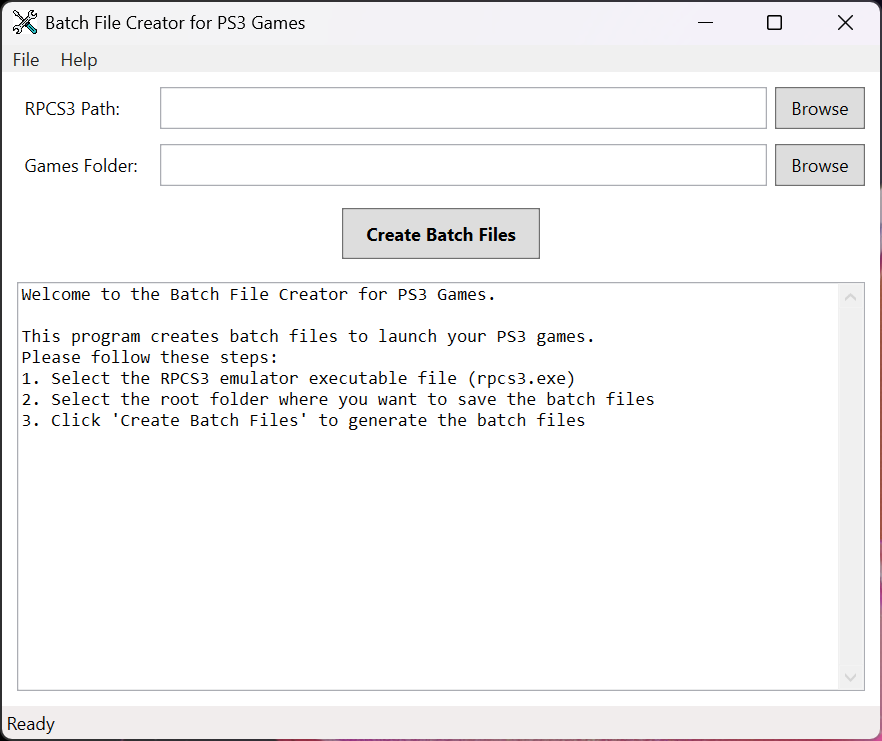

# Create Batch Files for PS3 Games

A Windows desktop utility for creating batch files to launch PS3 games using the RPCS3 emulator.



## Overview

Create Batch Files for PS3 Games is a Windows application that provides a simple user interface to generate batch files for your PS3 game collection. These batch files allow you to quickly launch your games directly via RPCS3, integrate them into emulator frontends, or add them to platforms like Steam. The application automatically detects game folders and extracts game titles from `PARAM.SFO` files for accurate naming.

## Features

-   **User-Friendly Interface**: Clear guidance through each step of the process.
-   **Automatic Game Detection**: Identifies PS3 game folders based on the presence of `PS3_GAME\USRDIR\EBOOT.BIN` and `PARAM.SFO` files.
-   **Accurate Batch File Naming**: Reads `PARAM.SFO` to extract the official game `TITLE` or `TITLE_ID` for naming batch files.
-   **Seamless Game Launching**: Generated batch files can be used to launch games directly, integrated into any emulator frontend, or added as non-Steam games.
-   **Detailed Logging**: Provides real-time log messages to inform you of the progress and any issues during the batch file creation process.

## Requirements

-   [.NET 10.0 Runtime](https://dotnet.microsoft.com/download/dotnet/9.0)
-   RPCS3 emulator (`rpcs3.exe`)

## Installation

1.  Download the latest release.
2.  Extract the ZIP file to a folder of your choice.
3.  Run `CreateBatchFilesForPS3Games.exe`.

## Usage

1.  **Select RPCS3 Executable**: Click "Browse" next to "RPCS3 Path" to select the `rpcs3.exe` file.
2.  **Select Games Folder**: Click "Browse" next to "Games Folder" to choose the root directory containing your PS3 game folders (e.g., `J:\Sony PS3 Roms`).
3.  **Create Batch Files**: Click "Create Batch Files" to start the process. The application will scan the selected folder and the RPCS3 `dev_hdd0\game` folder for PS3 games and generate `.bat` files in your selected "Games Folder".
4.  **Monitor Progress**: The application displays detailed log messages during the batch file creation process.

### Example Batch File Command

```bat
"G:\Emulators\RPCS3\rpcs3.exe" --no-gui "G:\Emulators\RPCS3\dev_hdd0\game\NPUB30024\USRDIR\EBOOT.BIN"
```

```bat
"G:\Emulators\RPCS3\rpcs3.exe" --no-gui "J:\Sony PS3 Roms\King of Fighters XIII, The (USA) (En,Ja,Fr,De,Es,It,Zh,Ko)\PS3_GAME\USRDIR\EBOOT.BIN"
```

## Troubleshooting

-   Ensure `rpcs3.exe` is correctly selected.
-   Verify that your game folders contain the `PS3_GAME\USRDIR\EBOOT.BIN` and `PARAM.SFO` files.
-   Check the application log window for detailed error messages.
-   Ensure you have appropriate read/write permissions for the selected folders.

## Technical Details

-   **Language & Framework:** Developed in C# using WPF.
-   **Target Framework:** .NET 9.0 for Windows.
-   **Compatibility:** Designed for Windows and tested on Windows 11 (expected to work with Windows 7 and later).

## Support

If you like the software, please give us a star.<br>
Consider [donating](https://www.purelogiccode.com/donate) to support the project or simply to express your gratitude!

---

Developed by [Pure Logic Code](https://www.purelogiccode.com).